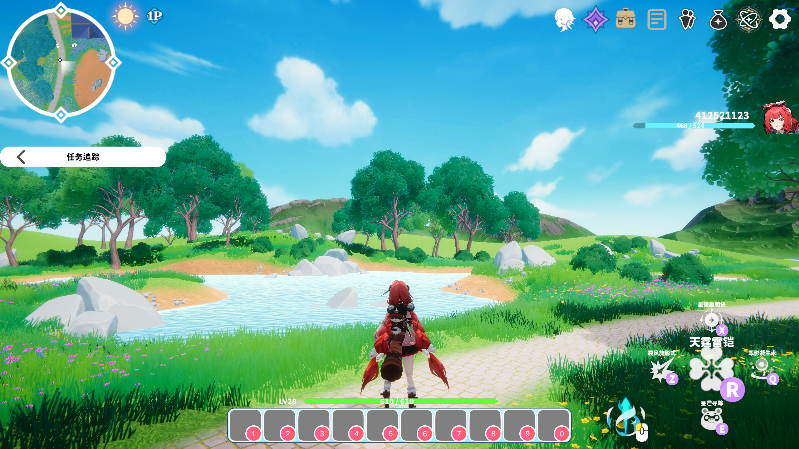
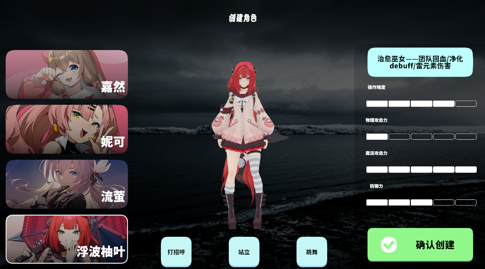
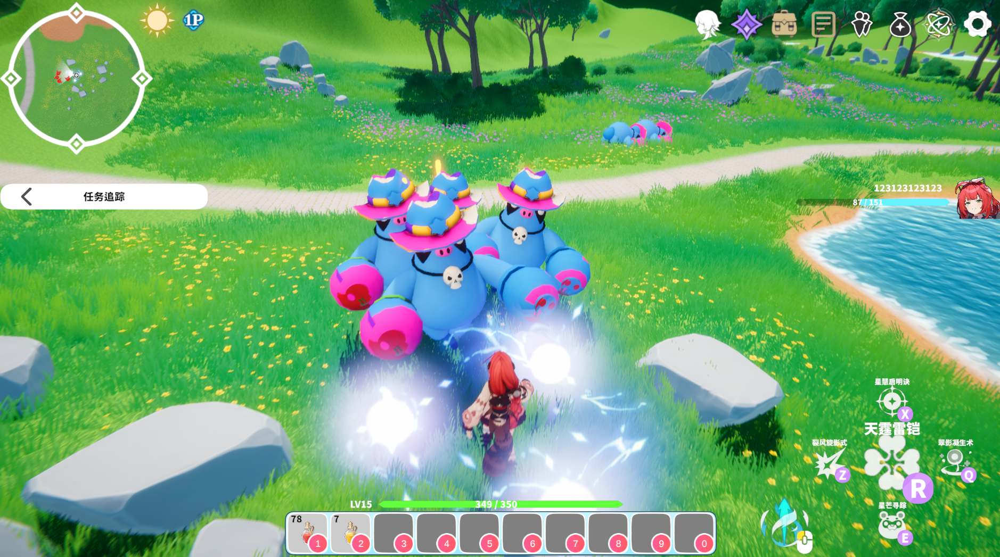
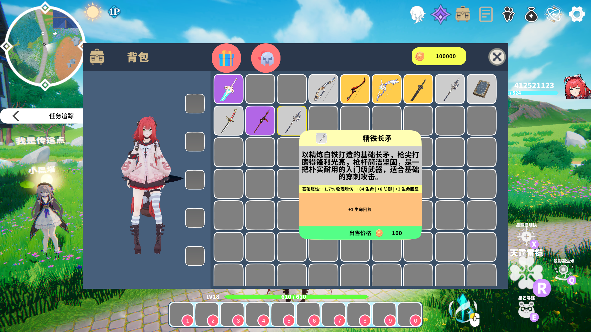
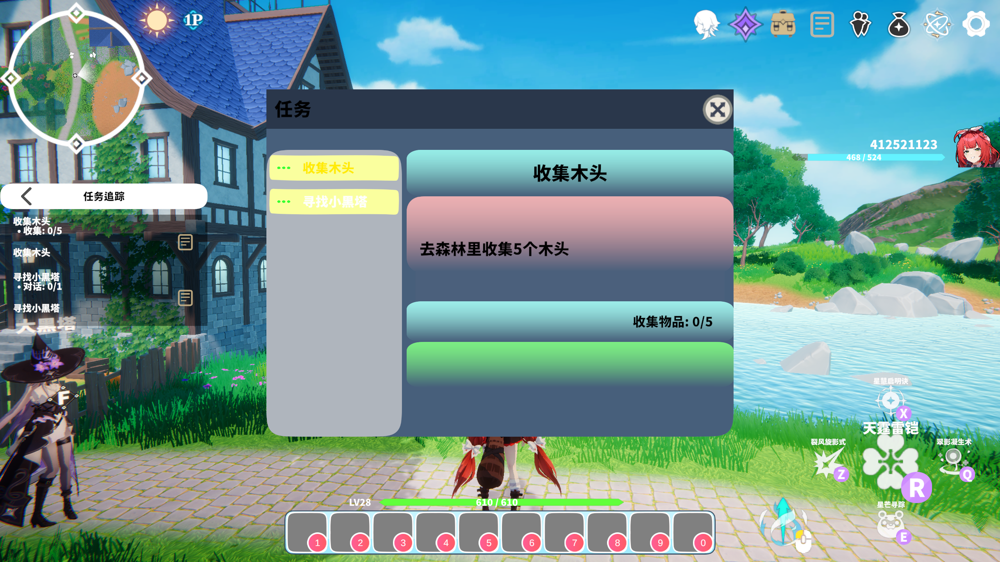
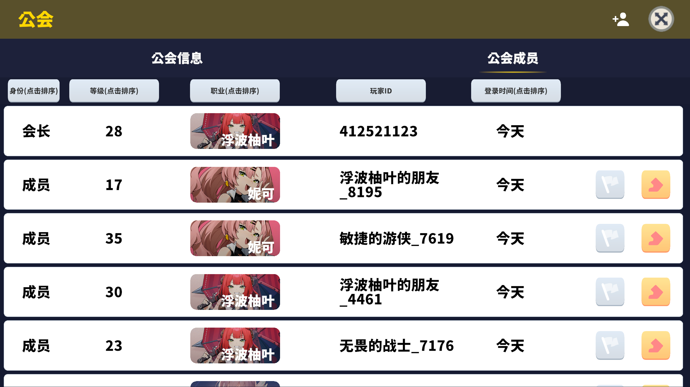

# Unity 3D RPG 游戏项目

<div align="center">

[](https://unity.com/)
[](LICENSE)
[]()



**一个功能完整的 3D RPG 游戏框架，包含完整的角色系统、战斗系统、技能系统、任务系统、背包系统、公会系统等核心模块**

[快速开始](#快速开始) • [功能特性](#功能特性) • [技术架构](#技术架构) • [项目结构](#项目结构) • [开发文档](#开发文档)

</div>

---

## 📋 目录

- [项目简介](#项目简介)
- [功能特性](#功能特性)
  - [抽卡系统](#-抽卡系统)
- [技术栈](#技术栈)
- [快速开始](#快速开始)
- [项目结构](#项目结构)
- [技术架构](#技术架构)
- [核心系统详解](#核心系统详解)
- [设计模式](#设计模式)
- [性能优化](#性能优化)
- [开发指南](#开发指南)
- [常见问题](#常见问题)
- [贡献指南](#贡献指南)
- [许可证](#许可证)

---

## 🎮 项目简介

这是一个基于 Unity 引擎开发的 3D RPG 游戏项目，采用模块化架构设计，包含完整的 MMORPG 核心系统。项目展示了 Unity 开发能力、系统架构设计能力、代码重构治理能力和 MMO 联机架构设计能力。

### 项目亮点

✅ **完整的 RPG 核心系统** — 角色创建、战斗、技能、任务、背包、公会等  
✅ **MMO 联机架构** — 客户端-服务端分离，5 容器 Docker 编排，双窗口互见 + HP 同步  
✅ **上帝类治理** — GameManager 800+ 行 → 完全删除，绞杀者模式三阶段迁移  
✅ **依赖注入** — VContainer DI 容器集成，14+ Manager 注册，支持单元测试 Mock  
✅ **UniTask 异步** — 40+ 文件全部替换 Coroutine，零 `async void` 残留  
✅ **事件驱动** — ScriptableObject Event Channel + TaskEventBridge 统一任务事件生命周期  
✅ **FSM 状态机** — 怪物 7 状态 FSM + 玩家 12 状态 FSM，动画 Blend Tree + Trigger 驱动  
✅ **单元测试** — 41 个 NUnit 测试覆盖 4 模块  
✅ **GC 优化** — LINQ 清理、委托缓存、对象池化  
✅ **原神风格抽卡** — 单抽 + 十连抽，武器池随机，品质/星级转换，抽卡动画与结算特效

---

## ✨ 功能特性

### 🧙 角色系统



- 角色创建与选择
- 属性系统（生命、攻击、防御、暴击等）
- 等级与经验系统
- 装备系统（武器、防具、饰品）
- Buff/Debuff 系统
- 死亡与复活机制

### ⚔️ 战斗系统

<!--  -->


- 实时战斗机制
- 全局冷却（GCD）系统
- 目标锁定系统
- 伤害计算与暴击判定
- 战斗状态机
- 受击反馈系统
- **MMO 服务端权威战斗**：CombatServer 伤害计算 + Buff/Debuff 系统

### 🌟 技能系统

- 主动技能与被动技能
- 技能冷却系统
- 技能升级机制
- 技能等级上限控制
- 投射物技能
- Buff 效果技能
- 技能快照机制

### 🎒 背包系统



- 物品增删改查
- 装备与卸下
- 物品堆叠
- 物品使用
- 背包容量管理
- 拖拽系统
- 物品分类（装备、消耗品、材料）

### 🎴 抽卡系统


- 单抽与十连抽
- 原神风格 UI 与抽卡动画
- 武器池随机抽取
- 星级→品质转换（传说5星 / 史诗4星 / 稀有3星 / 普通2星）
- 抽卡结果自动入库（InventoryManager 集成）
- 品质背景、闪光特效、结算图集

### 📜 任务系统



- 主线任务与支线任务
- 任务链系统
- 任务目标类型（击杀、收集、对话、到达等）
- 任务进度追踪
- 任务奖励发放
- 跨场景任务恢复
- **TaskEventBridge**：统一事件生命周期，防止场景切换泄漏

### 🏰 公会系统



- 公会创建与加入
- 公会成员管理
- 公会权限系统
- 公会数据持久化

### 🌐 MMO 联机系统


- **客户端-服务端分离架构**：Unity 客户端 + .NET 8 服务端三件套（Gateway / WorldServer / CombatServer）
- **Docker 一键部署**：5 容器编排（MongoDB / Redis / Gateway / WorldServer / CombatServer）
- **AOI 九宫格**：50m cell 空间分区，20 tick/s 快照广播
- **服务端权威战斗**：CombatServer 伤害公式 + Buff/Debuff，HP 同步到所有客户端
- **位置同步**：30Hz 发送 + 30ms 延迟平滑插值，双窗口互见移动
- **三通道通信**：HTTP JWT 登录 + TCP JSON 消息 + UDP 高频同步（预留）

### 🎨 UI 系统


- 模块化面板管理
- DOTween 动画效果
- Toast 提示系统
- 技能 Toast 专用提示
- 拖拽界面
- 设置面板（分辨率、热键等）

### 🎬 场景管理

- Addressables 场景加载
- 异步场景切换
- Loading 过渡界面
- 场景数据保存与恢复
- 玩家跨场景迁移

### 🎮 输入系统

- Unity 新输入系统
- 运行时热键修改
- 热键配置持久化
- 多设备支持

### 🔊 音频系统

- 背景音乐管理
- 音效管理
- UI 音效系统

---

## 🛠 技术栈

### 核心技术

| 技术         | 版本          | 用途             |
| ------------ | ------------- | ---------------- |
| **Unity**    | 6000.0.59f2+  | 游戏引擎         |
| **C#**       | 9.0+          | 编程语言         |
| **.NET**     | 8.0           | 服务端运行时     |
| **Docker**   | —             | 容器化部署       |
| **Redis**    | 7-alpine      | 服务间 Pub/Sub   |

### 核心包

| 包名                          | 用途               |
| ----------------------------- | ------------------ |
| **VContainer**                | DI 依赖注入        |
| **UniTask**                   | 零 GC 异步替代 Coroutine |
| **MongoDB.Driver**            | 数据库连接与操作   |
| **DOTween**                   | 动画效果           |
| **Cinemachine**               | 摄像机控制         |
| **TextMeshPro**               | 高质量文本渲染     |
| **Addressables**              | 资源管理与加载     |
| **Universal Render Pipeline** | 通用渲染管线       |
| **Post Processing**           | 后处理效果         |

### 第三方资源

- **Suntail Village** — 场景与美术资源
- **MagicaCloth2** — 布料模拟
- **Lofelt.NiceVibrations** — 触觉反馈
- **Damage Numbers Pro** — 伤害数字显示

---

## 🚀 快速开始

### 环境要求

- Unity 6000.0.59f2 或更高版本
- Visual Studio 2026 或 Rider
- MongoDB 4.4+ （可选，用于数据库功能）
- Git

### 安装步骤

1. **克隆仓库**

```bash
git clone https://github.com/yourusername/3DRPG.git
cd 3DRPG
```

2. **打开项目**

- 使用 Unity Hub 打开项目文件夹
- 等待 Unity 完成包导入

3. **安装必需包**

```
Window > Package Manager
- MongoDB.Driver
- DOTween
- Cinemachine
- TextMeshPro
- Addressables
```

4. **配置渲染管线**

**内置渲染管线（Built-in）:**

```
1. Package Manager > 安装 Post Processing
2. Edit > Project Settings > Player > Other Settings > Color Space: Linear
3. （可选）Suntail Village > Demo > Settings
```

**通用渲染管线（URP）:**

```
1. Edit > Project Settings > Player > Other Settings > Color Space: Linear
2. 解压 "SRP Packages" 文件夹中的 URP 包
3. Edit > Project Settings > Graphics > Scriptable Render Pipeline Settings: SuntailUniversalRenderPipelineAsset
```

5. **配置 MongoDB（可选）**

如果需要使用数据库功能：

```csharp
// 在 MongoDBManager 中配置连接字符串
private const string ConnectionString = "mongodb://localhost:27017";
```

6. **运行游戏**

- 打开 `Assets/Scenes/七月/登录界面/LoginScene 1.unity`
- 点击 Play 按钮

---

## 📁 项目结构

```
Assets/
├── Script/                    # 核心脚本
│   ├── Character/            # 角色系统
│   │   ├── CharacterAnimationController.cs
│   │   └── CharacterState.cs
│   ├── Combat/               # 战斗系统
│   │   └── GlobalCooldownController.cs
│   ├── Data/                 # 数据管理
│   │   ├── 道具数据/
│   │   │   ├── ItemDataSO.cs
│   │   │   └── PropertyScalingDataSO.cs
│   │   ├── 公会数据/
│   │   ├── 世界商店数据/
│   │   └── 玩家数据相关/
│   ├── Events/               # 事件系统
│   │   ├── BaseEventSO.cs
│   │   └── BaseEventListener.cs
│   ├── Input/                # 输入系统
│   │   ├── HotkeySettingsPanel.cs
│   │   └── KeybindingStorage.cs
│   ├── Map/                  # 地图管理
│   ├── Mgr/                  # 核心管理器
│   │   ├── GameDataConfig.cs       # SO 数据配置持有
│   │   ├── SessionManager.cs       # 会话/角色数据
│   │   ├── CharacterRuntimeManager.cs  # 运行时玩家实例
│   │   ├── SaveCoordinator.cs      # 统一存档编排
│   │   ├── MongoDBManager.cs
│   │   ├── InventoryManager.cs
│   │   ├── SkillManager.cs
│   │   ├── TaskManager.cs
│   │   ├── UIManager.cs
│   │   ├── SceneLoadManager.cs
│   │   ├── PlayerCurrencyManager.cs
│   │   ├── GuildManager.cs
│   │   ├── AudioManager.cs
│   │   ├── CharacterDataManager.cs
│   │   └── Singleton.cs
│   ├── Network/              # MMO 客户端网络层
│   │   ├── NetworkManager.cs
│   │   ├── TcpChannel.cs
│   │   ├── UdpChannel.cs
│   │   ├── EntitySyncManager.cs
│   │   ├── NetworkPlayerMover.cs
│   │   └── PositionInterpolator.cs
│   ├── Monster/              # 怪物系统
│   │   ├── MonsterBase.cs
│   │   ├── MonsterCombat.cs
│   │   ├── MonsterStateMachine.cs
│   │   └── MonsterState.cs
│   ├── NPC/                  # NPC系统
│   │   ├── NpcBase.cs
│   │   ├── NpcData.cs
│   │   └── NpcDialogUI.cs
│   ├── Player/               # 玩家系统
│   │   ├── CharacterState.cs
│   │   ├── MoveMent.cs
│   │   └── PlayerInteraction.cs
│   ├── ProjectBase/          # 基础框架
│   │   ├── Singleton.cs
│   │   └── BaseManager.cs
│   ├── Skill/                # 技能系统
│   │   ├── SkillManager.cs
│   │   ├── SkillController.cs
│   │   ├── SkillSO.cs
│   │   └── 具体技能实现/
│   ├── Task/                 # 任务系统
│   │   ├── TaskManager.cs
│   │   ├── TaskDataSO.cs
│   │   ├── TaskEvent.cs
│   │   ├── TaskEventBridge.cs
│   │   └── TaskTrackingService.cs
│   ├── VContainer/            # DI 容器配置
│   │   ├── GameLifetimeScope.cs
│   │   └── ServiceRegistration.cs
│   ├── Tests/                 # 单元测试
│   │   └── Editor/
│   │       ├── AudioManagerTests.cs
│   │       ├── InventoryManagerTests.cs
│   │       ├── CharacterStateTests.cs
│   │       └── EquipmentControllerTests.cs
│   ├── Teleport/             # 传送系统
│   ├── UI/                   # UI系统
│   │   ├── UIPopPanelBase.cs
│   │   ├── 商店界面/
│   │   ├── SkillUpgrade/
│   │   ├── 设置面板/
│   │   └── ...
│   ├── Utilit/               # 工具类
│   └── Editor/               # 编辑器扩展
├── Resources/                # 资源文件
│   ├── PlayingUI/            # UI预制件
│   ├── Prefab/Panel/         # 面板预制件
│   └── ...
├── Scenes/                   # 场景文件
│   ├── 七月/
│   │   ├── 登录界面/LoginScene 1.unity
│   │   ├── Level_1/Village.unity
│   │   └── Level_2/Forest.unity
│   └── LoadingScene.unity
└── Packages/                 # Unity包配置
    ├── manifest.json
    └── packages-lock.json
```

---

## 🏗 技术架构

### 架构设计原则

项目遵循以下架构原则：

1. **模块化设计** - 每个系统职责单一，高内聚低耦合
2. **事件驱动** - 使用 ScriptableObject 事件实现系统间通信
3. **数据驱动** - 配置与逻辑分离，使用 ScriptableObject 管理数据
4. **异步优先** - 数据库操作使用异步方式，避免阻塞主线程
5. **单例模式** - 核心管理器使用单例确保全局唯一

### 分层架构

```
┌─────────────────────────────────────────────┐
│              表现层 (Presentation)            │
│  ┌──────────┐  ┌──────────┐  ┌──────────┐  │
│  │   UI面板  │  │  场景对象 │  │  动画特效 │  │
│  └──────────┘  └──────────┘  └──────────┘  │
└─────────────────────────────────────────────┘
                      ↕ 事件/回调
┌─────────────────────────────────────────────┐
│              控制层 (Controller)             │
│  ┌──────────┐  ┌──────────┐  ┌──────────┐   │
│  │ Manager类│  │Controller│  │  事件系统 │   │
│  └──────────┘  └──────────┘  └──────────┘   │
└─────────────────────────────────────────────┘
                      ↕ 数据访问
┌─────────────────────────────────────────────┐
│               数据层 (Data)                  │
│  ┌──────────┐  ┌──────────┐  ┌──────────┐   │
│  │  SO配置  │  │ 运行时数据│  │  MongoDB │   │
│  └──────────┘  └──────────┘  └──────────┘   │
└─────────────────────────────────────────────┘
```

### 核心管理器体系

```
GameDataConfig (SO 数据配置持有者)
SessionManager (会话/角色数据)
CharacterRuntimeManager (运行时玩家实例)
SaveCoordinator (统一存档编排)
TaskEventBridge (任务事件生命周期)
├── MongoDBManager (数据库管理)
├── InventoryManager (背包管理)
├── SkillManager (技能管理)
├── TaskManager (任务管理)
├── UIManager (UI管理)
├── SceneLoadManager (场景管理)
├── PlayerCurrencyManager (货币管理)
├── GuildManager (公会管理)
├── AudioManager (音频管理)
├── CursorManager (光标管理)
└── CharacterDataManager (角色数据)
```
> GameManager 已于 2026-05 完全删除（800+ 行 → 0 行），职责分散至上述 6 个专职 Manager。

---

## 🔧 核心系统详解

### 1. 玩家系统

**核心类**: `CharacterState.cs` (partial)

**功能实现**:

```csharp
public class CharacterState : MonoBehaviour
{
    // 基础属性
    public int Level { get; private set; }
    public float MaxHealth { get; private set; }
    public float CurrentHealth { get; private set; }
    public float AttackPower { get; private set; }
    public float Defense { get; private set; }

    // 装备系统
    public EquipmentData GetCurrentEquipment() { }

    // 伤害计算
    public void TakeDamage(float damage) { }

    // 死亡与复活
    public void OnDeath() { }
    public void Respawn() { }
}
```

---

### 2. 技能系统

**核心类**: `SkillManager.cs`, `SkillController.cs`

**技能释放流程**:

```
玩家输入
  ↓
检查冷却与资源
  ↓
SkillController.CastSkill()
  ↓
目标判定
  ↓
伤害计算
  ↓
应用效果
  ↓
技能广播事件
```

**技能配置示例**:

```csharp
[CreateAssetMenu(fileName = "NewSkill", menuName = "Skills/Default Skill")]
public class SkillSO : ScriptableObject
{
    public string SkillID;
    public string skillName;
    public string description;
    public Sprite icon;
    public SkillEffectType skillType;  // 普通攻击/主动技能/被动技能
    public float cooldown;
    public float damage;
    public List<BuffEffectSO> buffEffects;
    public int[] levelCaps;
}
```

---

### 3. 抽卡系统

**核心类**: `DrawCardPanel.cs`, `LotteryPanel.cs`, `LotteryCell.cs`, `LegacyPackageManager.cs`

**抽卡流程**:

```
DrawCardPanel (选择单抽/十连)
  ↓
LotteryPanel (展示容器)
  ↓
LegacyPackageManager.GetLotteryRandom1/10()
  ↓ 从 PackageTable.asset 武器池随机抽取
星级→品质转换 + 随机装备属性
  ↓
InventoryManager.AddItemWithoutToast() 入库
  ↓
LotteryCell 卡片展示 (品质背景 + 闪光特效)
```

**配置表**:

```csharp
// PackageTable.asset — 武器池配置
// id / type / star / name / description / imagePath
// LegacyPackageManager 从中读取武器池执行随机抽取
```

**与新背包集成**:

```csharp
// InventoryManager.cs
public void AddItemWithoutToast(InventoryItem item)
{
    // 直接添加已生成的 InventoryItem (用于抽卡等场景)
}
```

---

### 4. 背包系统

**核心类**: `InventoryManager.cs`

**主要功能**:

- 异步加载/保存背包数据
- 物品增删改查
- 装备/卸下
- 物品使用
- 事件广播

**事件系统**:

```csharp
public class InventoryManager : Singleton<InventoryManager>
{
    public event Action<InventoryItem> OnItemAdded;
    public event Action<InventoryItem> OnItemRemoved;
    public event Action<EquipmentData> OnEquipmentChanged;
    public event Action OnInventoryUpdated;

    public async Task<bool> AddItemAsync(string itemID, int count)
    {
        // 添加物品逻辑
        OnItemAdded?.Invoke(newItem);
        await SaveInventoryAsync();
        return true;
    }
}
```

---

### 5. 任务系统

**核心类**: `TaskManager.cs`, `TaskDataSO.cs`

**任务状态流转**:

```
未接受 → 已接受 → 进行中 → 已完成 → 已领取奖励
         ↓
       已放弃
```

**任务事件系统**:

```csharp
public static class TaskEvents
{
    public static event Action<string> OnTaskStarted;
    public static event Action<string> OnTaskCompleted;
    public static event Action<string> OnTaskAbandoned;
    public static event Action<string, string, int> OnObjectiveProgress;
    public static event Action<string> OnTaskRewardClaimed;
}
```

---

### 6. UI 系统

**核心类**: `UIManager.cs`, `UIPopPanelBase.cs`

**面板打开流程**:

```csharp
// 方式1: 泛型方法（推荐）
var panel = UIManager.Instance.OpenPanel<SkillUpgradePanel>(out bool isOpen);
if (isOpen)
{
    panel.Init();
}

// 方式2: 字符串方法（原神风格）
var panel = UIManager.Instance.OpenPanel("PackagePanel");
```

**动画效果**:

```csharp
public virtual void Show(Action onComplete = null)
{
    transform.localScale = Vector3.one * 0.8f;
    transform.DOScale(Vector3.one, 0.3f).SetEase(Ease.OutBack);

    canvasGroup.alpha = 0f;
    canvasGroup.DOFade(1f, 0.3f).OnComplete(() =>
    {
        canvasGroup.interactable = true;
        canvasGroup.blocksRaycasts = true;
        onComplete?.Invoke();
    });
}
```

---

### 7. 场景管理

**核心类**: `SceneLoadManager.cs`

**场景加载流程**:

```
SceneLoadManager.LoadScene(sceneName)
  ↓
保存当前角色数据
  ↓
销毁当前玩家
  ↓
加载新场景（Addressables）
  ↓
显示 LoadingScreen
  ↓
创建新玩家
  ↓
恢复角色数据
  ↓
隐藏 LoadingScreen
```

---

### 8. 输入与热键系统

**核心特性**:

- 基于 Unity 新输入系统
- 运行时修改热键
- 热键配置持久化到 PlayerPrefs
- 多实例同步

**使用示例**:

```csharp
// 修改热键
HotkeySettingsPanel.SaveBinding("Skill1", newKeybinding);

// 自动保存到 PlayerPrefs
KeybindingStorage.SaveBindings();

// 下次启动自动加载
InputBindingBootstrap.LoadBindingsOnStartup();
```

---

### 9. 数据库集成

**核心类**: `MongoDBManager.cs`

**异步操作示例**:

```csharp
public class MongoDBManager : Singleton<MongoDBManager>
{
    private IMongoCollection<CharacterData> _characters;

    public async Task<bool> SaveCharacterAsync(CharacterData data)
    {
        var filter = Builders<CharacterData>.Filter.Eq("_id", data._id);
        var result = await _characters.ReplaceOneAsync(
            filter,
            data,
            new ReplaceOptions { IsUpsert = true }
        );
        return result.IsAcknowledged;
    }

    public async Task<CharacterData> LoadCharacterAsync(string characterId)
    {
        var filter = Builders<CharacterData>.Filter.Eq("_id", characterId);
        return await _characters.Find(filter).FirstOrDefaultAsync();
    }
}
```

---

## 🎯 设计模式

### 1. 单例模式 (Singleton)

所有核心管理器都继承 `Singleton<T>`:

```csharp
public abstract class Singleton<T> : MonoBehaviour where T : MonoBehaviour
{
    private static T _instance;
    public static T Instance => _instance;

    protected virtual void Awake()
    {
        if (_instance != null && _instance != this)
        {
            Destroy(gameObject);
            return;
        }
        _instance = (T)this;
    }
}
```

**应用场景**: GameDataConfig, SessionManager, SaveCoordinator, InventoryManager, SkillManager, TaskEventBridge 等 14+ Manager

---

### 2. 事件驱动模式

使用 `BaseEventSO<T>` 实现解耦通信:

```csharp
// 定义事件
[CreateAssetMenu(menuName = "Events/Int Event")]
public class IntEventSO : BaseEventSO<int> { }

// 触发事件
healthEventSO.Raise(currentHealth);

// 监听事件
public class HealthListener : BaseEventListener<int, IntEventSO>
{
    public IntEventSO Event;
    public UnityEvent<int> Response;

    public void OnEventRaised(int value) => Response.Invoke(value);
}
```

---

### 3. ScriptableObject 数据驱动

配置数据与逻辑分离:

```csharp
[CreateAssetMenu(fileName = "NewItem", menuName = "Data/Items/Equipment")]
public class EquipmentData : ScriptableObject
{
    public string itemID;
    public string itemName;
    public ItemType itemType;
    public int baseAttack;
    public int baseDefense;
    public PropertyScalingDataSO scalingData;
}
```

**优势**:

- 数据可视化编辑
- 数据与逻辑分离
- 易于版本控制
- 运行时加载

---

### 4. 状态机模式

**怪物 FSM**（7 个独立状态类）：

```csharp
// 状态基类
public abstract class MonsterStateBase
{
    public abstract void Enter();
    public abstract void Update();
    public abstract void Exit();
    public abstract MonsterState CheckTransitions();
}

// 7 个状态：Patrol → Chase → Alert → Attack → Death / ReturnToSpawn → Idle
public class MonsterChaseState : MonsterStateBase { /* 追击逻辑 */ }
public class MonsterAttackState : MonsterStateBase { /* 攻击冷却 + 3 种随机攻击动画 */ }
// ...

// 动画系统：Blend Tree 2D + Trigger 驱动
// VSpeed/HSpeed → Idle/Walk/Run, Attack/Death/Alert → Trigger
```

**玩家 FSM**（12 个独立状态类）：Idle / Walk / Sprint / Crouch / Jump / Fall / Roll / Attack / Hit / Death / Cast / Interact。物理移动、旋转矫正、跳跃朝向全部迁移至各状态类的 `FixedUpdate()` / `LateUpdate()`。

---

### 5. MVC/MVP 模式

```
Model (数据层)
  ├── ScriptableObject 配置
  ├── 运行时数据
  └── MongoDB 数据库

View (表现层)
  ├── UI 面板
  ├── 场景对象
  └── 动画/特效

Controller (控制层)
  ├── Manager 类
  ├── Controller 类
  └── 事件系统
```

---

## ⚡ 性能优化

### 1. UniTask 异步体系

- 全面替换 Coroutine（40+ 文件），零 `async void` 残留
- `.Forget()` 即发即忘 + `PlayerLoopTiming` Unity 原生调度
- `await UniTask.Delay` 零 GC 分配
- 场景卸载时自动取消未完成异步操作

### 2. GC 优化

- **LINQ 清理**：热路径中 `.Where()`/`.Select()`/`.ToList()` 替换为 `for`/`foreach` + 手动判断
- **委托缓存**：消除每帧 Closure 分配
- **对象池化**：投射物、UI Toast 高频创建销毁对象复用

### 3. 资源管理

- Addressables 按需加载
- 场景切换时及时卸载资源
- UI 面板复用机制

---

## 📚 开发指南

### 添加新技能

1. 创建 SkillSO 配置文件
2. 实现技能逻辑类
3. 在 AllSkillsSO 中注册
4. 配置冷却、伤害等参数

### 添加新物品

1. 创建 ItemDataSO 配置文件
2. 设置物品属性与类型
3. 配置属性缩放规则
4. 在 ItemDataSO 数据库中注册

### 添加新任务

1. 创建 TaskDataSO 配置文件
2. 设置任务目标与奖励
3. 配置任务链关系
4. 在 TaskDataSO 数据库中注册

### 添加新面板

1. 继承 `UIPopPanelBase`
2. 设计 UI 布局
3. 实现面板逻辑
4. 在 UIManager 中注册

---

## ❓ 常见问题

### Q1: 游戏运行时材质显示为粉色？

**A**: 场景使用了 URP 但未正确配置渲染管线。

**解决方法**:

```
Edit > Project Settings > Graphics
设置 Scriptable Render Pipeline Settings 为 SuntailUniversalRenderPipelineAsset
```

### Q2: MongoDB 连接失败？

**A**: 检查 MongoDB 服务是否启动，连接字符串是否正确。

**解决方法**:

```csharp
// MongoDBManager.cs
private const string ConnectionString = "mongodb://localhost:27017";
```

### Q3: 热键修改后重启丢失？

**A**: 确保添加了 `InputBindingBootstrap` 组件。

**解决方法**:

1. 在主场景创建空 GameObject，命名为 `InputBootstrap`
2. 附加 `InputBindingBootstrap.cs` 脚本

### Q4: 场景切换时数据丢失？

**A**: 确保在场景切换前保存数据。

**解决方法**:

```csharp
SaveCoordinator.Instance.SaveCurrentCharacterData().Forget();
await SceneLoadManager.Instance.LoadSceneAsync("NewScene");
```

---

## 🤝 贡献指南

欢迎贡献代码！请遵循以下步骤：

1. Fork 本仓库
2. 创建特性分支 (`git checkout -b feature/AmazingFeature`)
3. 提交更改 (`git commit -m 'Add some AmazingFeature'`)
4. 推送到分支 (`git push origin feature/AmazingFeature`)
5. 提交 Pull Request

### 代码规范

- 遵循 C# 编码规范
- 添加必要的注释
- 使用有意义的变量/函数名
- 保持代码简洁清晰

---

## 📄 许可证

本项目采用 MIT 许可证 - 详见 [LICENSE](LICENSE) 文件

---

## 📧 联系方式

- **作者**: [Coolcoolcoo]
- **GitHub**: [https://github.com/iikunn-kk](https://github.com/iikunn-kk)
- **邮箱**: [2228054362@qq.com](mailto:2228054362@qq.com)

---

## 🙏 致谢

感谢以下开源项目和资源：

- [Unity](https://unity.com/) - 游戏引擎
- [MongoDB](https://www.mongodb.com/) - 数据库
- [DOTween](https://dotween.demigiant.com/) - 动画库
- [Cinemachine](https://unity.com/unity/features/editor/art-and-design/cinemachine) - 摄像机系统
- [TextMeshPro](https://textmeshopro.com/) - 文本渲染
- [Suntail Village](https://assetstore.unity.com/packages/3d/environments/fantasy/suntail-village-low-poly-3d-asset-215919) - 场景资源

---

<div align="center">

**如果这个项目对你有帮助，请给个 ⭐️ Star！**

Made with ❤️ by [Coolcoolcoo]

</div>
